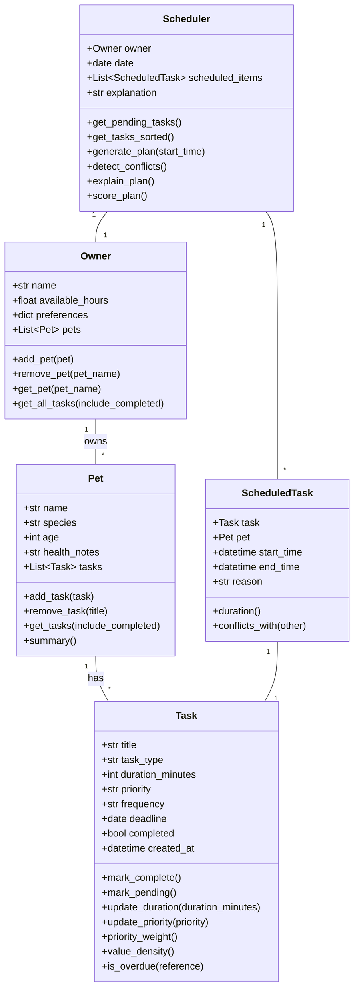

# PawPal+ (Module 2 Project)

**PawPal+** is a Streamlit app that helps a busy pet owner plan daily care tasks for their pets.

## Scenario

A busy pet owner needs help staying consistent with pet care. They want an assistant that can:

- Track pet care tasks (walks, feeding, meds, enrichment, grooming, etc.)
- Consider constraints (time available, priority, deadlines)
- Produce a daily plan and explain why it chose that plan

## What you will build

Your final app should:

- Let a user enter basic owner + pet info
- Let a user add/edit tasks (duration + priority at minimum)
- Generate a daily schedule/plan based on constraints and priorities
- Display the plan clearly (and ideally explain the reasoning)
- Include tests for the most important scheduling behaviors

## Getting started

### Setup

```bash
python -m venv .venv
source .venv/bin/activate  # Windows: .venv\Scripts\activate
pip install -r requirements.txt
```

### Suggested workflow

1. Read the scenario carefully and identify requirements and edge cases.
2. Draft a UML diagram (classes, attributes, methods, relationships).
3. Convert UML into Python class stubs (no logic yet).
4. Implement scheduling logic in small increments.
5. Add tests to verify key behaviors.
6. Connect your logic to the Streamlit UI in `app.py`.
7. Refine UML so it matches what you actually built.

## System Diagram (Mermaid)



## Smarter Scheduling

PawPal+ includes intelligent scheduling capabilities:

- **Priority-weighted task selection** — uses a 0/1 knapsack algorithm to choose the highest-value combination of tasks that fits within the owner's available time budget.
- **Deadline-aware sort order** — tasks are ordered by deadline → priority → duration → creation time, so urgent and important tasks are always placed first.
- **Recurring task handling** — `daily` and `weekly` tasks automatically generate a new occurrence (with the next due date via `timedelta`) when marked complete, keeping the task list fresh without manual re-entry.
- **Conflict detection** — `ScheduledTask.conflicts_with()` compares time slots and returns human-readable warning strings rather than raising exceptions, letting the UI surface problems gracefully.
- **Plan explanation** — `Scheduler.explain_plan()` returns a concise summary of minutes used, minutes remaining, and any detected conflicts.

## Features

- Add multiple pets with species, age, and health notes
- Add care tasks with title, type, duration, priority, frequency, and optional deadline
- Generate a daily schedule respecting available hours
- View tasks sorted by urgency before scheduling
- See conflict warnings highlighted in the UI
- Plan score shows fraction of total tasks scheduled
- Recurring tasks roll over automatically on completion

## 📸 Demo

<a href="/Demo.png" target="_blank">
  
</a>

## Testing PawPal+

To run tests:

```bash
python -m pytest
```

Tests cover:

- `Task` completion toggling (`mark_complete` sets `completed = True`)
- `Pet` task management (adding a task increases task count)
- `Scheduler` knapsack-based task selection (high-priority task chosen within capacity)
- Recurring task generation (`daily` task creates next occurrence with `deadline + 1 day`)
- Conflict detection (two tasks at the same start time produce a warning message)
