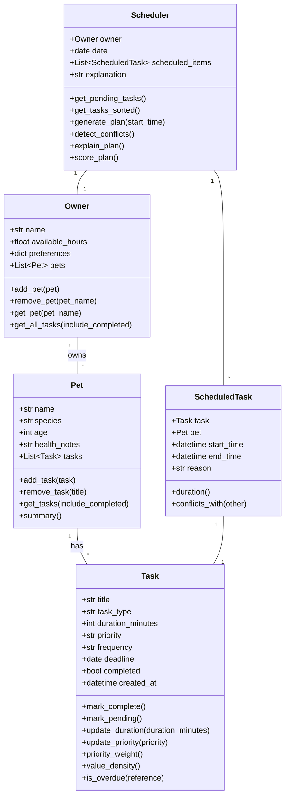

# PawPal+ Project Reflection

## 1. System Design

**a. Initial design**

- Briefly describe your initial UML design.
  - I designed a domain model for pet care scheduling with five classes: Owner, Pet, Task, ScheduledTask, and Scheduler. The design separates raw task data from scheduled instances so the scheduler can reason about time slots independently from task definitions.
- What classes did you include, and what responsibilities did you assign to each?
  - `Owner`: holds owner profile (name, available hours, preferences) and a list of pets. Responsible for providing time constraints to the scheduler.
  - `Pet`: holds pet details (name, species, age, health notes) and a list of tasks. Responsible for managing care tasks assigned to a specific animal.
  - `Task`: represents a single care activity (title, type, duration, priority, frequency, deadline). Responsible for task state and completion logic.
  - `ScheduledTask`: wraps a Task with a concrete start/end time and a reason string. Responsible for conflict checking and time-slot tracking.
  - `Scheduler`: orchestrates planning. Responsible for selecting tasks within available time, ordering them, generating the schedule, detecting conflicts, and explaining choices.

Core user actions:
1. Add or edit a pet profile so the system has context for care requirements.
2. Add and prioritize care tasks (walking, feeding, meds, enrichment, grooming) with duration and optional deadlines.
3. Generate and view a daily schedule with task order, timing, and reasoning.

**b. Design changes**

- Did your design change during implementation?
  - Yes. The initial sketch had a simpler Scheduler that iterated tasks greedily in priority order. During implementation it was replaced with a knapsack-style value-weighted selection to better respect the available_hours budget.
- If yes, describe at least one change and why you made it.
  - `ScheduledTask` was added to separate raw task definitions from scheduled time slots. This made conflict detection straightforward (compare start/end datetimes) without coupling that logic to Task itself.
  - `mark_complete()` was changed from a void method to one that returns an Optional[Task] representing the next occurrence of a recurring task. This kept recurrence logic self-contained in Task instead of spreading it across Scheduler.

---

## 2. Scheduling Logic and Tradeoffs

**a. Constraints and priorities**

- What constraints does your scheduler consider (for example: time, priority, preferences)?
  - Available time (`Owner.available_hours` converted to minutes) — the plan never exceeds daily capacity.
  - Priority levels (`Task.priority`: high / medium / low) encoded as numeric weights (100 / 50 / 20) to prefer the most critical pet care actions.
  - Optional deadlines (`Task.deadline`) and recurrence frequency (`Task.frequency`) so overdue items surface early and daily/weekly tasks roll over automatically.
  - Completed state — only pending tasks get scheduled.
  - Conflict detection via `ScheduledTask.conflicts_with` for overlapping time slots.

- How did you decide which constraints mattered most?
  - Available time and task urgency directly affect pet welfare and owner effort, so they are primary. Priority and deadlines reflect real-world care needs (feeding before optional grooming when time is scarce). Recurrence and conflict detection were added so owners can trust the plan is both repeatable and non-overlapping.

**b. Tradeoffs**

- Describe one tradeoff your scheduler makes.
  - The scheduler uses a 0/1 knapsack on priority weight to select tasks, then sequences them in sorted order (deadline → priority → duration → creation time). This maximizes priority value within available time but ignores task-specific preferred time windows (e.g., "walk at 8 AM only").

- Why is that tradeoff reasonable for this scenario?
  - Pet owners need fast, understandable schedules in a conversational UI, not heavy computation. A knapsack over small task lists (typically < 20) runs instantly and yields practically good plans. The tradeoff is documented so users know time-window constraints are a future enhancement.

---

## 3. AI Collaboration

**a. How you used AI**

- How did you use AI tools during this project (for example: design brainstorming, debugging, refactoring)?
  - Used AI to brainstorm the domain model and class interactions, suggest the knapsack approach for capacity-limited scheduling, implement recurring task generation with `timedelta`, draft conflict detection, and wire Streamlit `st.session_state` for stateful UI.
- What kinds of prompts or questions were most helpful?
  - Focused prompts referencing specific files worked best: "Based on #file:pawpal_system.py, how should Scheduler retrieve tasks from Owner's pets?" and "How could this algorithm be simplified for better readability?" gave targeted, usable responses.

**b. Judgment and verification**

- Describe one moment where you did not accept an AI suggestion as-is.
  - AI initially generated `mark_complete()` as a simple `self.completed = True` with no return value. I required it to return a new Task instance for recurring tasks so recurrence logic stayed self-contained. I modified the signature to `Optional[Task]` and added the `timedelta` branching.
- How did you evaluate or verify what the AI suggested?
  - I wrote and ran unit tests (`python -m pytest`) after each change to confirm behavior. For the knapsack selection I traced through a small example manually to verify the DP table produced the expected subset.

---

## 4. Testing and Verification

**a. What you tested**

- What behaviors did you test?
  - Task completion toggling (`mark_complete` sets `completed = True`).
  - Pet task management (adding a task increases count).
  - Scheduler knapsack selection (high-priority task chosen over lower-priority fit).
  - Recurring task generation (daily task creates next occurrence with `deadline + 1 day`).
  - Conflict detection (two tasks at the same start time produce a warning).
- Why were these tests important?
  - They verify the core scheduling logic that the UI depends on, ensuring the plan is feasible, recurring tasks roll over, and conflicts are surfaced rather than silently dropped.

**b. Confidence**

- How confident are you that your scheduler works correctly?
  - 4/5 — all tests pass and core behaviors are covered. More edge cases (zero-duration tasks, invalid priority values, very large task lists) could be added.
- What edge cases would you test next if you had more time?
  - Zero or negative duration tasks.
  - Invalid priority strings falling back to medium weight.
  - Tasks whose duration exceeds total available hours.
  - Simultaneous start/end boundary overlap in generate_plan.

---

## 5. Reflection

**a. What went well**

- What part of this project are you most satisfied with?
  - The recurring task design — `mark_complete()` returning the next Task instance keeps recurrence self-contained in the data model and makes the Scheduler's generate_plan loop clean: just call `mark_complete()` and re-add the result if it exists.

**b. What you would improve**

- If you had another iteration, what would you improve or redesign?
  - Add time-window attributes to Task (earliest/latest start) so the scheduler can respect constraints like "medication only after 7 AM." Also add a calendar view in Streamlit rather than a flat table.

**c. Key takeaway**

- What is one important thing you learned about designing systems or working with AI on this project?
  - AI accelerates scaffolding and pattern recognition but still requires a human architect to set boundaries. The most valuable moments were when I pushed back on AI suggestions (like the void `mark_complete`) and shaped the design toward cleaner, testable interfaces. Being explicit about *why* a design choice matters — not just accepting the first workable suggestion — is the core skill.
